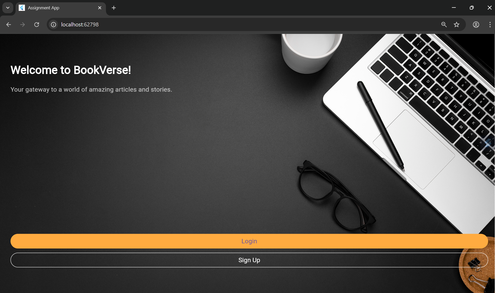

# 📱 Mobile Assignment App

This is a **Flutter-based mobile app** built as part of the evaluation process for a Mobile App Developer role.

## Getting Started

This project is a starting point for a Flutter application.

---

## ✅ Features

- 🏠 **Home Screen** with a welcome message
- 🔐 **Login & Sign-Up Screens** (UI only)
- 📰 **Articles Screen** that fetches and displays dummy articles using a public API
- 🔁 Smooth **navigation** between screens
- 🛡️ **Basic form validation** (checks for empty fields)
---

## 📸 Screenshots

### Home Screen


### Login Screen
.png)

### Sign Up Screen
.png)

### Articles Screen
.png)

---

## 📋 Screens Overview

| Screen | Description |
|--------|-------------|
| Home | Welcome message + Login & Sign Up buttons |
| Login | Email & password fields + form check |
| Sign Up | Same as login (UI only) |
| Articles | Fetched articles shown in list view |


---

## 📲 Tech Stack

- **Flutter (3.x)**
- **Dart**
- **HTTP Package**
- **Material Design**
- **Git / GitHub for version control**

---

## 🔗 Public API Used

Data is fetched from [JSONPlaceholder](https://jsonplaceholder.typicode.com/posts) – a free fake REST API for testing and prototyping.

---

## 🚀 Getting Started

1. Clone the repository:
```bash
git clone https://github.com/YOUR_USERNAME/mobile_assignment_app.git
cd mobile_assignment_app
```

2. Install dependencies:
```bash
flutter pub get
```

3. Run the app:
```bash
flutter run
```

---

## 📸 Screens Overview

| Screen | Description |
|--------|-------------|
| Home | Welcome message + Login & Sign Up buttons |
| Login | Email & password fields + form check |
| Sign Up | Same as login (UI only) |
| Articles | Fetched articles shown in list view |

---

## 📁 Folder Structure

```
lib/
┣ main.dart
┗ screens/
  ┣ home_screen.dart
  ┣ login_screen.dart
  ┣ signup_screen.dart
  ┗ articles_screen.dart
```

---

## ✅ Assignment Checklist

- [x] Home screen with welcome message
- [x] Login and Sign Up UI
- [x] Article list fetched via API
- [x] Navigation between screens
- [x] Form validation
- [x] Code versioned with Git
- [x] Code pushed to GitHub

---

## 👨‍💻 Developer

**Sushanth Reddy Palavalli**  
*Mobile App Developer Candidate*  
[GitHub Profile](https://github.com/YOUR_USERNAME)

---

*Ready for submission! 💼📲*
